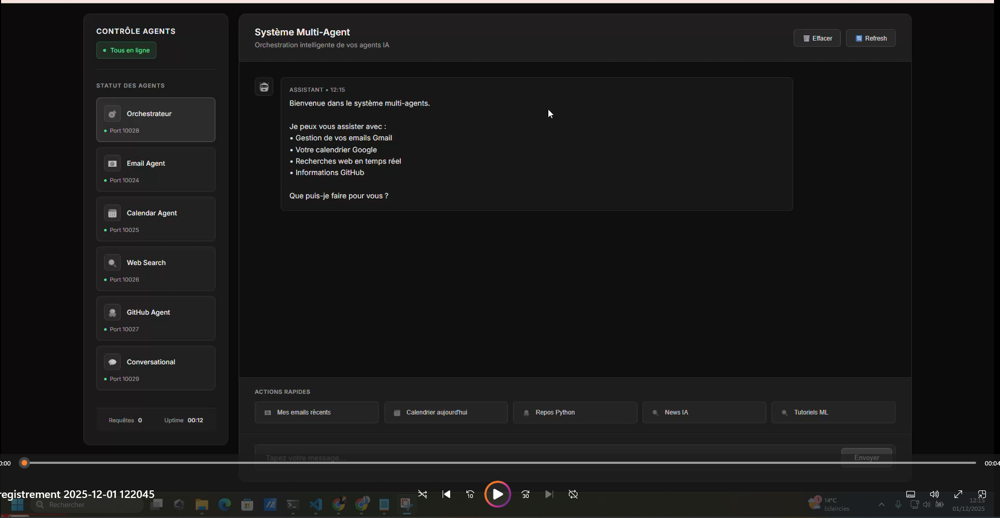

# Multi-Agent MCP – Gmail, Calendar, Web & GitHub Orchestrator

Système multi-agent basé sur **Google ADK (Agent Development Kit)** et **A2A (Agent-to-Agent)**, exposé via une **API Flask** avec une interface web moderne.  
L’orchestrateur IA coordonne plusieurs agents spécialisés (Gmail, Calendar, Web Search, GitHub, Conversation) pour exécuter des tâches complexes de manière unifiée.

---

## 🎥 Démonstration

### 🖼 Aperçu de l’interface

> Tableau de bord temps réel montrant l’état des agents (Email, Calendar, Web Search, GitHub, Conversational) et un chat centralisé piloté par l’orchestrateur.

### 🎬 Vidéo de démonstration

[▶ Voir la démo vidéo](https://vimeo.com/1142186208)

---

## 🤖 Description du projet

Ce projet implémente un **système multi-agent MCP** capable de :

- Gérer vos **emails Gmail** (lecture, recherche, envoi)
- Interagir avec **Google Calendar** (liste, création, suppression d’événements, disponibilité)
- Effectuer des **recherches web** via DuckDuckGo
- Consommer l’API **GitHub** (repos, issues, trending, stats, etc.)
- Fournir une **interface de chat moderne** pour piloter tous les agents à travers un **Orchestrateur IA**

Les agents exposent une API A2A et sont **MCP-compliant** : ils peuvent être branchés sur d’autres systèmes MCP si besoin.

---

## 🧩 Architecture Multi-Agent

### 🧠 Orchestrator Agent

- Rôle : **cerveau central**
- Analyse la requête utilisateur et route vers :
  - Email Agent
  - Calendar Agent
  - Web Search Agent
  - GitHub Agent
  - Conversational Agent
- Vérifie et reformate les réponses des autres agents (formats standardisés pour le frontend)

### 📧 Email Agent (Gmail)

- Liste les derniers emails
- Recherche d’emails par mots-clés
- Envoi d’emails Gmail directement
- Utilise l’API Gmail avec un `credentials.json` et un token combiné (`token_combined.pickle`)

### 📅 Calendar Agent (Google Calendar)

- Liste des événements à venir
- Création d’événements
- Suppression d’événements
- Vérification de la disponibilité sur une date donnée

### 🔍 Web Search Agent

- Recherche web via **DuckDuckGo Search**
- Retourne les résultats formatés (titre, URL, snippet)

### 🐙 GitHub Agent

- Recherche de repos GitHub
- Infos utilisateur
- Statistiques d’un repo (stars, forks, issues, langue, taille…)
- Liste des repos d’un utilisateur
- Création d’issues
- Recherche d’issues
- “Trending” repos par langage et période (daily/weekly/monthly – simulation via critères de recherche)

### 💬 Conversational Agent

- Agent “généraliste” pour les réponses naturelles
- Explique, reformule, propose des actions, guide l’utilisateur
- Respecte les formats des autres agents lorsqu’il parle d’emails, calendrier, GitHub, etc.

---
